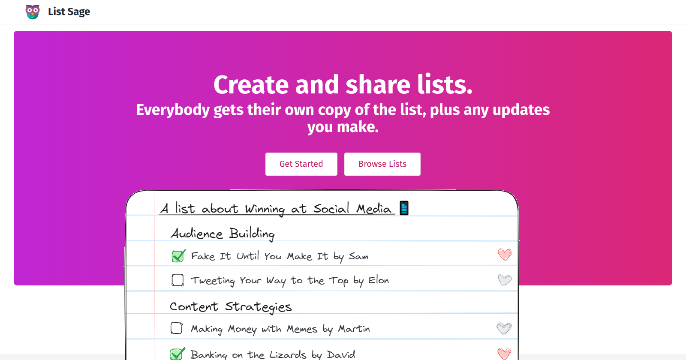

# 📰 List Sage

## 🧰 Tech Stack

- [Appwrite](https://appwrite.io/)
- [SvelteKit](https://kit.svelte.dev/)

## Deployment to Appwrite Cloud

1. Create a new project on Appwrite Cloud

2. Install the Appwrite CLI

3. `appwrite client --endpoint https://cloud.appwrite.io/v1 --projectId <PROJECT_ID>`

4. `appwrite login`

5. `cd appwrite`

6. `./deploy.sh`

## Deployment to Appwrite Server

1. Install the Appwrite Server

2. Follow the same instructions as for the Cloud setup, except use your localhost endpoint